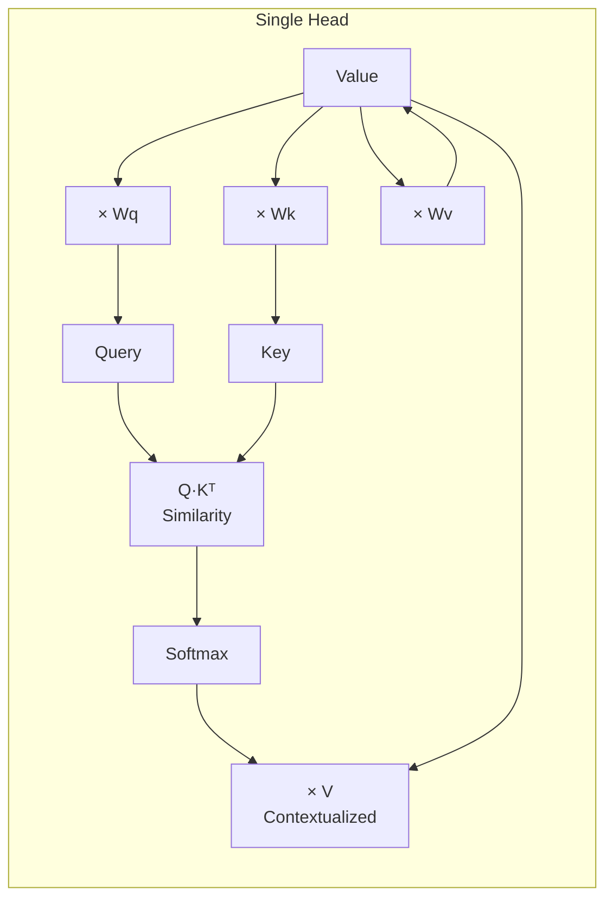

# Attention

**Category:** 

## Definition

A mechanism that lets each token look at *every other token* in the sequence, computing similarity scores to contextualize each vector. A token's initial embedding is ambiguous ('bank' could mean river or finance); attention resolves this by looking at surrounding tokens.

**Mechanics:** Three matrices (Q, K, V) per token. Similarity = Q · Kᵀ. Output = softmax(similarity) · V.

**Multi-head attention:** Multiple attention operations run in parallel (typically 8-96 heads). Each head learns to focus on different relationships: one head might track subject-verb agreement, another might track references across sentences.

## Why It Matters

Attention is the core innovation of the transformer. Without it, models couldn't understand context beyond nearby words. It's what lets 'it' in 'The trophy didn't fit in the suitcase because it was too big' correctly refer to 'trophy' (not 'suitcase').

## Analogy

Imagine a crowded party. You hear your name mentioned across the room. Your brain instantly tunes out 50 other conversations and focuses on the one mentioning you. Attention does the same for every token simultaneously — each word 'listens' to all other words and decides which ones are relevant to its meaning.

## Visual

## Mentioned In

[LLM Basics & Transformer Internals](../sessions/llm-basics-transformer-internals.md), [LLM Basics & Transformer Internals](../sessions/llm-basics-transformer-internals.md), [LLM Basics & Transformer Internals](../sessions/llm-basics-transformer-internals.md)

## Related Concepts

- [Transformer](transformer.md)
- [KV Cache](kv-cache.md)
- [Masked Attention](masked-attention.md)
- [Feed-Forward Network](feed-forward-network.md)

## Further Reading

- [Attention Is All You Need (Vaswani et al., 2017)](https://arxiv.org/abs/1706.03762)
- [Attention? Attention! (Lilian Weng)](https://lilianweng.github.io/posts/2018-06-24-attention/)
- [Visualizing Attention (3Blue1Brown)](https://www.youtube.com/watch?v=eMlx5fFNoYc)
