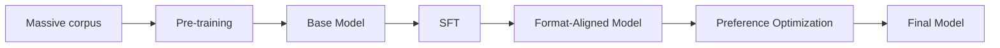

# Base Model

**Category:** Training Pipeline

## Definition

The output of pre-training. A transformer-stack that has completed the next-token-prediction objective over a huge corpus but has not yet been fine-tuned for instruction-following, chat, or any task. It can complete text and exhibits "intelligence" (language, grammar, world knowledge) but does not yet reliably follow instructions or hold a conversation.

**Also called:** foundation model, pre-trained model, raw model.

## Why It Matters

The base model is where ~90% of an LLM's "intelligence" lives — it has been exposed to the equivalent of millions of books and has compressed that information into its weights. Post-training (SFT + preference opt) mostly adds *style*, *format*, and *alignment* on top of this existing capability, not new knowledge.

## Analogy

The base model is like a brilliant autodidact who has read every book in the library but has never been taught how to answer a question politely. Post-training is the etiquette lessons that turn the autodidact into a tutor.

## Visual

## Mentioned In

- [2. Training Pipeline & Tool Use](../sessions/2-training-pipeline.md)

## Related Concepts

- [Pre-training](../concepts/pre-training.md)
- [Supervised Fine-Tuning](../concepts/supervised-fine-tuning.md)
- [Preference Optimization](../concepts/preference-optimization.md)
- [Post-Training](../concepts/post-training.md)

## Further Reading

- [Ouyang et al., 2022 — InstructGPT](https://arxiv.org/abs/2203.02155) — *canonical paper positioning the base model vs the post-trained chat model.*
- [Sebastian Raschka — "LLM Training and Evaluation"](https://sebastianraschka.com/blog/2023/llm-training-and-evaluation.html)
