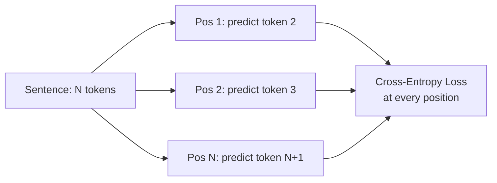

# Fill-in-the-Blank Training

**Category:** 

## Definition

The core training technique for LLMs. Each sentence of N tokens is converted into N training questions — one per token position. 'There is no tomorrow.' → the model predicts: 'There is no ___' at each position simultaneously. N tokens = N training signals per sentence.

**Enabled by masked attention:** Without masking, the model could cheat by looking ahead. Masking forces it to predict based only on what it's seen so far.

## Why It Matters

This training technique is what makes LLM pre-training data-efficient. Instead of one training example per sentence, you get one per token — a 1000-word article gives ~1500 training signals, not 1. This is why LLMs can be trained on 'only' trillions of tokens.

## Analogy

Fill-in-the-blank training is like learning a language by reading with a cover card. You read the first word, guess the second. Read the first two, guess the third. You're always predicting the next word using only what came before — and you get feedback after every single word.

## Visual

## Mentioned In

[Training Pipeline & Tool Use](../sessions/llm-training-pipeline-tool-use.md)

## Related Concepts

- [Masked Attention](masked-attention.md)
- [Cross-Entropy Loss](cross-entropy-loss.md)
- [Training Loop](training-loop.md)
- [Pre-training](pre-training.md)

## Further Reading

- [How GPT models work (J. Alammar)](https://jalammar.github.io/how-gpt3-works-visualizations-animations/)
- [nanoGPT (Karpathy)](https://github.com/karpathy/nanoGPT)
