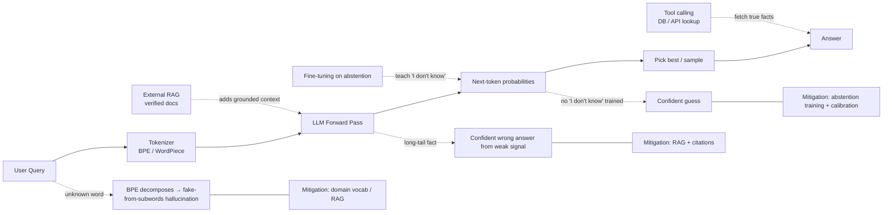

# Hallucination

**Category:** LLM behavior / capability failure mode

## Definition

**Hallucination** is when a model produces output that *sounds* confident and plausible but is factually incorrect, fabricated, or unsupported by its training data. The model is doing exactly what it was trained to do — generate the most likely next token — but with incomplete information.

Hallucinations happen in three common ways:
1. **Factual errors** — the model confidently states a false fact ("The Eiffel Tower is in London").
2. **Fabricated sources** — the model invents citations, URLs, or quotes that don't exist.
3. **Unsupported leaps** — the model fills in missing details with plausible-but-wrong guesses.

## Why It Matters

Hallucination is the single most important reliability failure mode in production LLM systems. A chatbot that "lies with confidence" is a trust liability. Every major LLM product (search engines, copilots, customer service bots) ships with at least one of: a retrieval layer (RAG), a citation requirement, or an "I don't know" fail-safe — all are anti-hallucination interventions.

> **Why this happens:** During pre-training, the model learns the *statistical patterns* of language — not a database of facts. When asked about something it has only partial knowledge of, the model draws on those patterns to produce the *most plausible* continuation, not the *true* one.

## Analogy

Imagine a brilliant student who has studied 10,000 books but skipped the chapter on a specific topic. Asked about that topic, the student doesn't say "I don't know" — instead, they weave a smooth, plausible answer from related material. That's an LLM hallucinating. The student isn't lying; they're pattern-matching on what they do remember.

The fix in both cases is similar: **give them the right material to work from** before they answer (RAG, retrieval, tool use) or **teach them to abstain** when they don't know (fine-tuning on "I don't know" examples, calibration).

## The Three Failure Surfaces

| Failure | Cause | Mitigation |
|---------|-------|------------|
| **Subword decomposition of unknown words** (e.g. "PromptForge" → "Prompt" + "Forge") | BPE tokenizer breaks any input into known pieces; the LLM fills in | RAG, fine-tuning, restricted vocabulary |
| **Long-tail factual recall** | Training data is finite; rare facts may be wrong or absent | External knowledge base (RAG, vector DB) |
| **Confident extrapolation** | Loss function rewards fluent continuation, not truthfulness | Calibration training, tool calling, "abstain" behavior |

## Visual

## Mentioned In

- [LLM Basics & Transformer Internals](../sessions/1-llm-basics.md)
- [Week 1 Doubts & Networking](../sessions/3-week-1-doubts.md)

## Related Concepts

- [Token](token.md) — hallucinations often start when an unknown token is broken into subwords
- [Byte Pair Encoding (BPE)](byte-pair-encoding.md) — the subword tokenizer that drives the unknown-token case
- [Vector (Embedding)](vector-embedding.md) — RAG hinges on retrieving the right embeddings
- [Context Window](context-window.md) — bigger context → more chances to inject verified context
- [Supervised Fine-Tuning (SFT)](supervised-fine-tuning.md) — fine-tuning can teach abstention

## Further Reading

- [Ji et al., 2023 — Survey of Hallucination in Natural Language Generation](https://arxiv.org/abs/2202.03629)
- [Lewis et al., 2020 — Retrieval-Augmented Generation (RAG)](https://arxiv.org/abs/2005.11401)
- [Anthropic — Reducing Hallucinations (Claude docs)](https://docs.anthropic.com/en/docs/build-with-claude/test-and-evaluate/strengthen-guardrails/reduce-hallucinations)
- [OpenAI — Why language models hallucinate (2025)](https://openai.com/index/why-language-models-hallucinate/)
