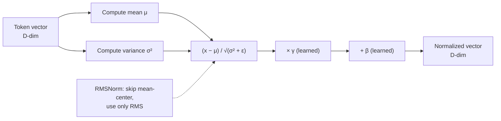

# Layer Normalization (LayerNorm / RMSNorm)

**Category:** Architecture & Internals

## Definition

A normalization step applied across the feature dimension for each token independently. Subtracts the mean, divides by the standard deviation, then applies a learned scale and bias. Runs alongside attention and the FFN inside every transformer block.

**Variants:**
- **LayerNorm** (Ba, Kiros & Hinton, 2016) — full mean-center + std-normalize + learned scale/bias.
- **RMSNorm** (Zhang & Sennrich, 2019) — drops mean-centering, uses only root-mean-square scale. ~30–50% cheaper, used by Llama, Mistral, most modern open models.

## Why It Matters

LayerNorm is preferred over BatchNorm for transformers because it works on a single example (no batch dependence) and produces identical results at train and inference time. Without it, training deep transformers becomes numerically unstable.

## Analogy

LayerNorm is like recalibrating a measurement before you act on it. If you've been weighing ingredients on a scale that drifts, you re-zero it before every batch — LayerNorm does the same for every token's activations.

## Visual

## Lecture's take

**From [Session 1](../sessions/1-llm-basics.md):**

> The lecture mentions layer norm as the "root-mean-square normalize" step that runs alongside attention and the FFN. The deeper mechanics are not explored.

## Mentioned In

- [LLM Basics & Transformer Internals](../sessions/1-llm-basics.md)

## Related Concepts

- [Transformer](transformer.md)
- [Feed-Forward Network](feed-forward-network.md)

## Further Reading

- [Ba, Kiros & Hinton, 2016 — "Layer Normalization"](https://arxiv.org/abs/1607.06450)
- [Zhang & Sennrich, 2019 — "Root Mean Square Layer Normalization"](https://arxiv.org/abs/1910.07467)
