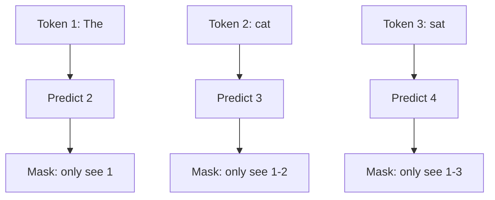

# Masked Attention (Causal Masking)

**Category:** 

## Definition

Masks the upper triangle of the attention similarity matrix so each token can only attend to itself and previous tokens — not future tokens. This is called 'causal' masking because the future cannot cause the present.

**Why it matters for training:** A sentence of N tokens gives N training signals (predict token 2 from token 1, token 3 from tokens 1-2, etc.) instead of just 1.

## Why It Matters

Masked attention is what makes LLM pre-training efficient. Without it, you'd get one training signal per sentence. With it, you get N signals — the entire backbone of fill-in-the-blank training.

## Analogy

Like a test where you can't look ahead. On question 5, you can use what you learned from questions 1-4, but you can't peek at question 6. The model learns to predict at every position using only what came before — which is exactly what it needs to do at inference time.

## Visual

## Mentioned In

[LLM Basics & Transformer Internals](../sessions/llm-basics-transformer-internals.md), [Training Pipeline & Tool Use](../sessions/llm-training-pipeline-tool-use.md)

## Related Concepts

- [Attention](attention.md)
- [Fill-in-the-Blank Training](fill-in-the-blank-training.md)
- [Training Loop](training-loop.md)

## Further Reading

- [The Annotated Transformer (Harvard NLP)](https://nlp.seas.harvard.edu/annotated-transformer/)
- [Causal Attention explained](https://sebastianraschka.com/blog/2023/self-attention-from-scratch.html)
