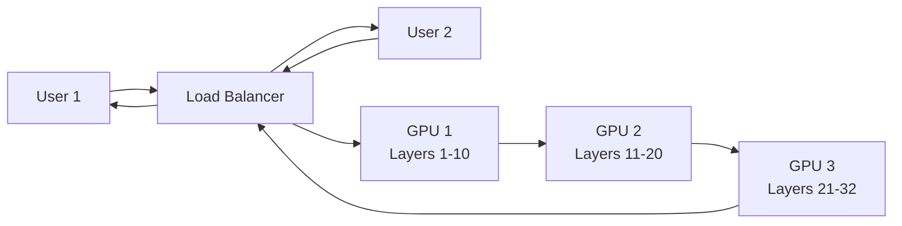

# Model Serving

**Category:** 

## Definition

After post-training, weights are frozen and deployed to GPUs. Users send queries and receive responses. Internal weights are NOT changed during inference — the model is read-only at this stage.

**GPU Pipeline Parallelism:** When a model is too large for one GPU, different layers sit on different GPUs. An orchestrator passes data between them: GPU-1 processes layers 1-10, passes to GPU-2 for layers 11-20, etc. The final prediction flows back through the orchestrator.

## Why It Matters

Model serving is where cost meets performance. The decisions here — batching strategy, KV cache management, GPU allocation — determine whether your API costs $0.01 or $0.10 per query. The rise of inference-optimized frameworks (vLLM, TensorRT-LLM) has made serving 10-100x more efficient.

## Analogy

Model serving is like a restaurant kitchen during dinner rush. The recipe (model weights) is fixed. Multiple orders (queries) come in. A good kitchen processes them in batches, shares prep work (KV cache), and distributes dishes across cooks (GPUs). A bad kitchen makes each dish one at a time.

## Visual

## Lecture's take

**From [Session 2](../sessions/2-training-pipeline.md):**

> (paraphrased from the serving discussion) Inference is frozen-weights-only; the same set of weights is queried for every user request.

## Mentioned In

[Training Pipeline & Tool Use](../sessions/2-training-pipeline.md)

## Related Concepts

- [Large Language Model](large-language-model.md)
- [KV Cache](kv-cache.md)
- [GPU Orchestration](gpu-orchestration.md)

## Further Reading

- [vLLM: Easy, Fast, Cheap LLM Serving](https://arxiv.org/abs/2309.06180)
- [How continuous batching works (Anyscale)](https://www.anyscale.com/blog/continuous-batching-llm-inference)
