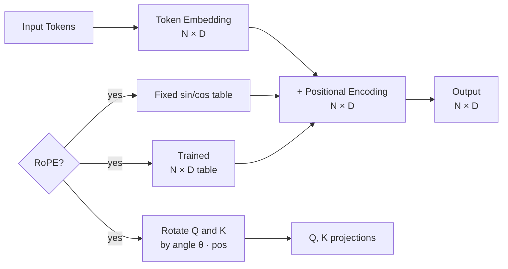

# Positional Encoding

**Category:** Architecture & Internals

## Definition

A vector added to each token's embedding that encodes the token's position in the sequence. Without it, "cat eats fish" and "fish eats cat" would be indistinguishable to the transformer — attention is permutation-equivariant by design.

**Variants:**
- **Sinusoidal** (original transformer, Vaswani 2017) — fixed `PE(pos, 2i) = sin(pos / 10000^(2i/D))`, `cos` for odd dimensions. Not learned.
- **Learned absolute** — a `[max_len × D]` table of position embeddings, trained with the model.
- **RoPE (Rotary Position Embedding)** — rotates Q and K vectors by an angle proportional to their position. Used by Llama, Mistral, most modern open models. Generalises better to context lengths beyond those seen at training.

## Why It Matters

Attention treats input as a set, not a sequence. Without positional encoding, the model has no way to distinguish word order — and order is what makes language language. RoPE in particular is what made 32k→128k→1M context windows possible.

## Analogy

Imagine each word in a sentence is a person in a row. Without positional info, they're all standing in a featureless white room. A positional encoding is the number on their shirt: 1, 2, 3, 4 — now you know who said what, and who spoke before whom.

## Visual

## Lecture's take

**From [Session 1](../sessions/1-llm-basics.md):**

> The transformer needs to know the position of each token in the sequence. A positional encoding is added to each token's embedding so that "the dog bit the man" and "the man bit the dog" produce different vectors.

## Mentioned In

- [LLM Basics & Transformer Internals](../sessions/1-llm-basics.md)
- [Week 1 Doubts & Networking](../sessions/3-week-1-doubts.md)

## Related Concepts

- [Transformer](transformer.md)
- [Attention](attention.md)

## Further Reading

- [Vaswani et al., 2017 — §3.5 (sinusoidal positional encoding)](https://arxiv.org/abs/1706.03762)
- [Su et al., 2021 — "RoFormer: Enhanced Transformer with Rotary Position Embedding"](https://arxiv.org/abs/2104.09864)
- [Lilian Weng — "Attention? Attention!" — Positional Encoding](https://lilianweng.github.io/posts/2018-06-24-attention/)
