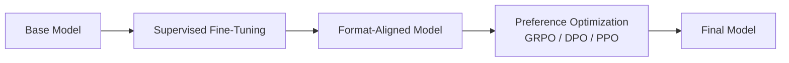

# Post-Training

**Category:** Training Pipeline

## Definition

The full second stage of LLM training — everything that happens after pre-training to turn a base model into a useful chat / instruction-following model. Comprises **Supervised Fine-Tuning (SFT)** followed by **Preference Optimization** (RLHF family: PPO, DPO, GRPO).

**Note:** "Post-training" is *not* validation. Validation is a held-out data split used during a single training run. Post-training is an entirely separate training stage on curated data.

## Why It Matters

Post-training is where the base model — which knows language but not how to be helpful — becomes a chat assistant. This is also where safety guardrails, refusal behaviour, and tool-calling conventions get installed.

## Analogy

Post-training is apprenticeship. Pre-training taught the model to read and write. Post-training teaches it to be useful: respond to questions in a structured way, refuse unsafe requests, call tools, and match the user's preferred tone.

## Visual

## Mentioned In

- [3. Week 1 Doubts & Networking](../sessions/3-week-1-doubts.md)

## Related Concepts

- [Pre-training](../concepts/pre-training.md)
- [Base Model](../concepts/base-model.md)
- [Supervised Fine-Tuning](../concepts/supervised-fine-tuning.md)
- [Preference Optimization](../concepts/preference-optimization.md)

## Further Reading

- [Ouyang et al., 2022 — InstructGPT](https://arxiv.org/abs/2203.02155) — *the canonical SFT → RM → PPO post-training pipeline.*
- [Sebastian Raschka — "LLM Training and Evaluation"](https://sebastianraschka.com/blog/2023/llm-training-and-evaluation.html)
