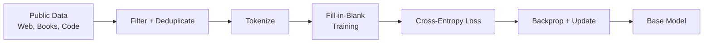

# Pre-training

**Category:** 

## Definition

The first and most expensive stage of LLM training. Massive public datasets (FineWeb2, BigCode, GitHub, web crawls, books) are fed through a transformer. The model learns language structure, grammar, and world knowledge — 'most of the intelligence.' Output: a **base model**.

**Data pipeline:** Clone sources → filter (license, file-type) → near-deduplicate → tokenize. Example from BigCode: 220M GitHub repos → 102 TB → 30% filtered → 6.4 TB after dedupe → 3 TB final.

## Why It Matters

Pre-training is where the model acquires its fundamental capabilities. Every other training stage (SFT, preference optimization) is frosting on the cake — pre-training baked the cake. The quality and diversity of pre-training data is the single biggest factor in model quality.

## Analogy

Pre-training is like a child learning language by reading the entire internet. They don't learn to be polite or follow instructions — they just learn how language works, what facts exist, and how ideas connect. Later stages teach them to be helpful assistants.

## Visual

## Mentioned In

- [Training Pipeline & Tool Use](../sessions/llm-training-pipeline-tool-use.md)
- [Week 1 Networking — Doubt-Solving](../sessions/doubts-networking-week-1.md)

## Related Concepts

- [Fill-in-the-Blank Training](fill-in-the-blank-training.md)
- [Training Loop](training-loop.md)
- [Cross-Entropy Loss](cross-entropy-loss.md)
- [Data Pipeline](data-pipeline.md)

## Further Reading

- [Llama 3 paper](https://arxiv.org/abs/2407.21783)
- [FineWeb: largest open pre-training dataset](https://huggingface.co/datasets/HuggingFaceFW/fineweb)
- [Training LLMs from Scratch (Sebastian Raschka)](https://magazine.sebastianraschka.com/p/building-llms-from-the-ground-up)
