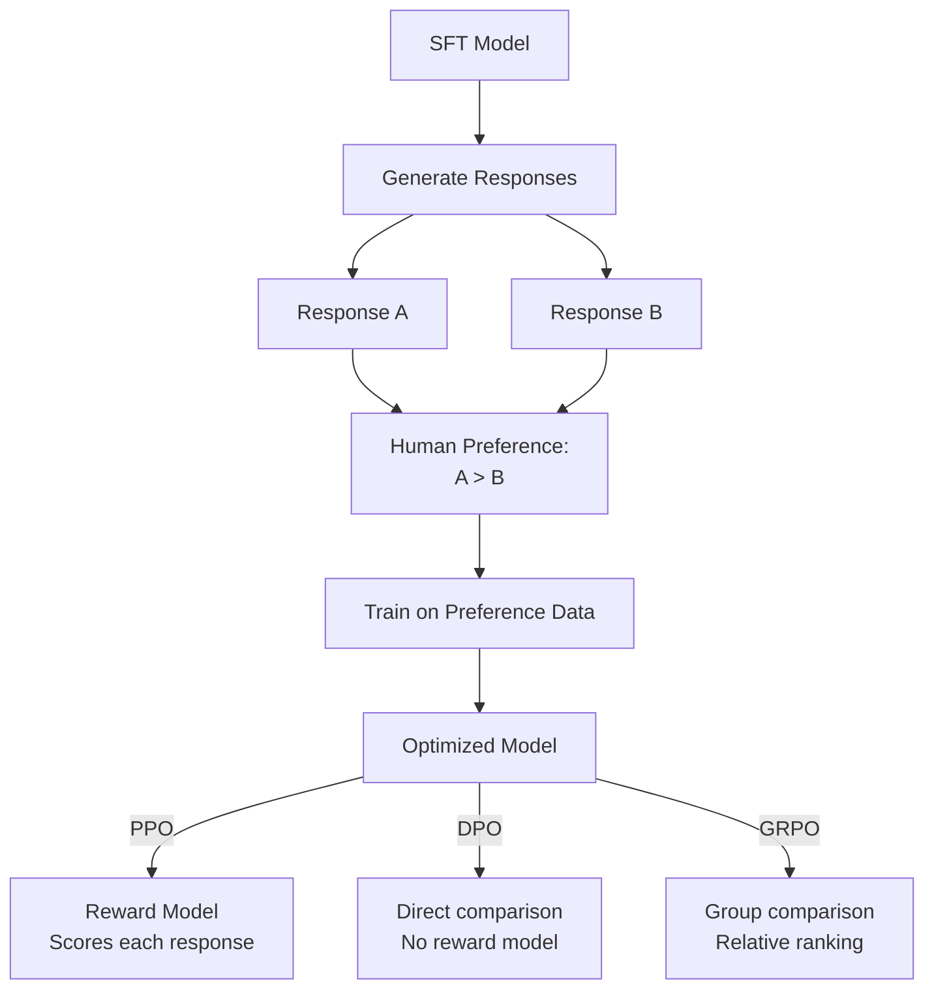

# Preference Optimization (RLHF Family)

**Category:** 

## Definition

A set of algorithms that refine model behavior using preference data — human (or AI) judgments about which response is better. After SFT teaches the model WHAT to say, preference optimization teaches it HOW to say it well.

**Variants:**
- **PPO (Proximal Policy Optimization):** Classic RLHF; uses a separate reward model trained on human preferences. Older but foundational.
- **DPO (Direct Preference Optimization):** Directly optimizes on preference pairs without a separate reward model. Simpler and more stable than PPO.
- **GRPO (Group Relative Policy Optimization):** Popularized by DeepSeek; generates multiple outputs per query and learns relative preferences within each group. Particularly effective for math and code.

**Conceptual anchor — Sigmoid:** Used in the class as a teaching tool. Sigmoid(+20) ≈ 1, Sigmoid(−20) ≈ 0. Maps 'how good' to a 0-1 score for optimization.

## Why It Matters

Preference optimization turns a capable-but-raw model into something you'd actually want to use. It reduces hallucinations, improves safety, makes responses more concise, and teaches the model when to say 'I don't know.'

## Analogy

Preference optimization is like a cooking competition. SFT taught the chef to cook. Now three judges taste each dish and score it. PPO: one judge with a detailed rubric. DPO: directly comparing two dishes side-by-side. GRPO: the chef cooks 4 versions and the best one wins — learning from internal competition.

## Visual

## Mentioned In

- [Training Pipeline & Tool Use](../sessions/llm-training-pipeline-tool-use.md)
- [Week 1 Networking — Doubt-Solving](../sessions/doubts-networking-week-1.md)

## Related Concepts

- [Supervised Fine-Tuning](supervised-fine-tuning.md)
- [Post-Training](post-training.md)
- [Base Model](base-model.md)

## Further Reading

- [PPO paper (Schulman et al., 2017)](https://arxiv.org/abs/1707.06347)
- [DPO paper (Rafailov et al., 2023)](https://arxiv.org/abs/2305.18290)
- [GRPO paper (DeepSeek, 2024)](https://arxiv.org/abs/2402.03300)
- [RLHF explained (HuggingFace)](https://huggingface.co/blog/rlhf)
