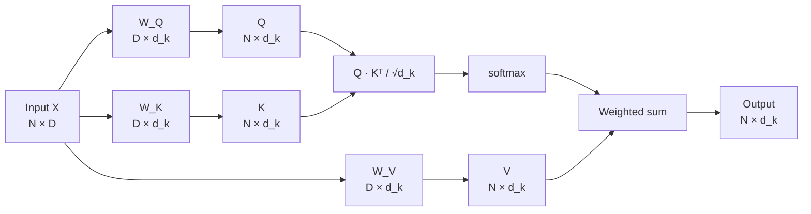

# Q, K, V (Query, Key, Value)

**Category:** Architecture & Internals

## Definition

Three learnable projection matrices (`W_Q`, `W_K`, `W_V`) applied to each token's input vector to produce three vectors per token. During attention, the **query** asks "what am I looking for?", the **key** advertises "what do I contain?", and the **value** carries the actual information to be aggregated.

**Formula:**
```
Q = X · W_Q
K = X · W_K
V = X · W_V
attention(Q, K, V) = softmax(Q · Kᵀ / √d_k) · V
```

## Why It Matters

The three matrices are the architectural move that makes attention expressive. Conceptually Q, K, V could all come from the same vector — three separate projections let the model decouple "what a token is asking for" from "what it advertises" from "what it actually contributes" to the output.

## Analogy

A library search:
- **Query** is your search request ("books about transformers").
- **Key** is the index card of each book ("this book is about transformers", "this one is about cats").
- **Value** is the book itself — the actual content you read when the key matches your query.

The library compares your query against every book's key, then pulls the value (content) of the matching books.

## Visual



## Lecture's take

**From [Session 1](../sessions/1-llm-basics.md):**

> Three vectors per token, computed by multiplying the input vector with three matrices. The attention formula: `sim = Q · K^T; output = softmax(sim) · V`. The lecture defers the deeper "why three matrices" question to a math deep-dive.

## Mentioned In

- [LLM Basics & Transformer Internals](../sessions/1-llm-basics.md)
- [Week 1 Doubts & Networking](../sessions/3-week-1-doubts.md)

## Related Concepts

- [Attention](attention.md)
- [KV Cache](kv-cache.md)
- [Transformer](transformer.md)

## Further Reading

- [Vaswani et al., 2017 — §3.2.1 (Q/K/V definitions)](https://arxiv.org/abs/1706.03762)
- [Jay Alammar — "The Illustrated Transformer"](https://jalammar.github.io/illustrated-transformer/)
