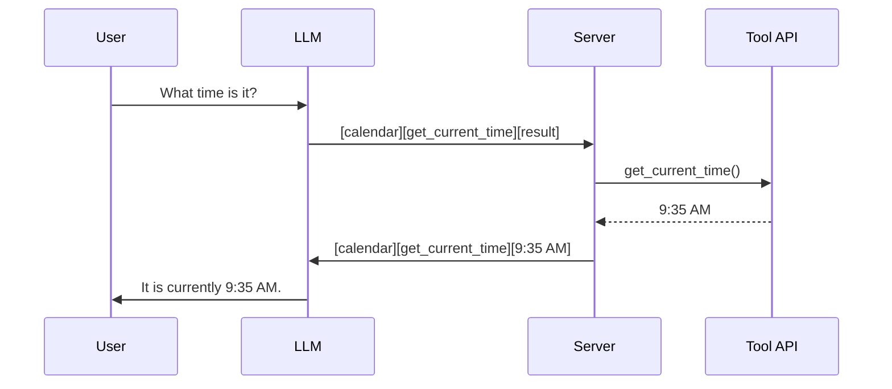

# Tool Calling / Function Calls

**Category:** 

## Definition

A capability installed during fine-tuning where the model is trained to output special tokens that the server interprets as function calls. The LLM does NOT call functions — it emits text. The server-side parses this text, executes the actual function, and feeds the result back into the prompt.

**Template example:** `time = [calendar] [get_current_time] [result]`

**Flow:** User asks 'what time is it?' → Model outputs tool-call template → Server parses and calls `get_current_time()` → Appends result `[9:35 AM]` → Model sees result and continues: 'It is currently 9:35 AM.'

## Why It Matters

Tool calling is how LLMs interact with the real world. Without it, an LLM is a closed system with frozen knowledge. With it, it can search the web, query databases, send emails, control devices. It's the foundation of AI agents.

## Analogy

Tool calling is like giving a blind person a phone. The person can't see your calendar, but they can call an assistant who can. The LLM 'calls' the tool (by outputting the right text template), the server acts as the assistant (executing the API call), and feeds the result back. The LLM never touches the calendar — it just knows the right words to make things happen.

## Visual

## Mentioned In

- [Training Pipeline & Tool Use](../sessions/llm-training-pipeline-tool-use.md)
- [Week 1 Networking — Doubt-Solving](../sessions/doubts-networking-week-1.md)

## Related Concepts

- [Supervised Fine-Tuning](supervised-fine-tuning.md)
- [Large Language Model](large-language-model.md)
- [Model Serving](model-serving.md)

## Further Reading

- [OpenAI Function Calling docs](https://platform.openai.com/docs/guides/function-calling)
- [Tool Use with Claude (Anthropic)](https://docs.anthropic.com/en/docs/build-with-claude/tool-use)
- [Gorilla: LLM connected to APIs](https://arxiv.org/abs/2305.15334)
