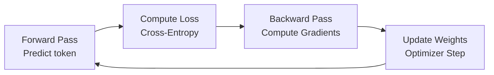

# Training Loop

**Category:** 

## Definition

The iterative process of training an LLM: 1. Predict the next token (forward pass). 2. Compare prediction to actual token (compute loss). 3. Compute gradients (backward pass). 4. Update weights (optimizer step). All weights inside the transformer (Q/K/V matrices, feed-forward, embeddings, linear layer) are updated.

**Batch:** Multiple sentences processed simultaneously for GPU efficiency.

## Why It Matters

The training loop is where all the cost lives. Pre-training can cost millions of dollars in GPU compute. Understanding the loop helps you estimate training costs and debug training failures.

## Analogy

The training loop is like practicing a musical instrument. You play a note (forward pass), compare it to the sheet music (loss), notice what you did wrong (backprop), and adjust your fingers (weight update). Repeat millions of times.

## Visual

## Lecture's take

**From [Session 2](../sessions/2-training-pipeline.md):**

> `predict token → compare to expected → cross-entropy loss → backprop → update weights`. The weights updated include the embedding, attention, FFN, and the final linear layer — every weight in the model is updated by every gradient step.

## Mentioned In

- [Training Pipeline & Tool Use](../sessions/2-training-pipeline.md)
- [Week 1 Networking — Doubt-Solving](../sessions/3-week-1-doubts.md)

## Related Concepts

- [Cross-Entropy Loss](cross-entropy-loss.md)
- [Fill-in-the-Blank Training](fill-in-the-blank-training.md)
- [Pre-training](pre-training.md)

## Further Reading

- [Backpropagation Explained (3Blue1Brown)](https://www.youtube.com/watch?v=Ilg3gGewQ5U)
- [How neural networks learn (Welch Labs)](https://www.youtube.com/watch?v=aircAruvnKk)
