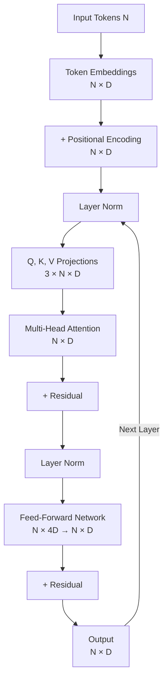

# Transformer

**Category:** 

## Definition

The internal architecture used by LLMs. A sequence of stacked blocks containing attention and feed-forward layers. Introduced in ["Attention Is All You Need" (Vaswani et al., 2017)](https://arxiv.org/abs/1706.03762).

**Flow:** Tokenize → Embed → Positional Encode → Layer Norm → Attention (Q/K/V) → FFN → Linear → Probabilities

## Why It Matters

The transformer is the engine of every modern LLM. Understanding the data flow through a transformer block is essential for debugging, optimization, and knowing what's actually happening when you call an API.

## Analogy

A transformer is like a team of editors working on a document simultaneously. Each editor (attention head) reads the entire document and suggests improvements to each word based on context. Then a feed-forward layer refines each word individually. Multiple editor teams (layers) pass the document around, each adding nuance.

## Visual

## Mentioned In

- [LLM Basics & Transformer Internals](../sessions/llm-basics-transformer-internals.md)
- [Training Pipeline & Tool Use](../sessions/llm-training-pipeline-tool-use.md)
- [Week 1 Networking — Doubt-Solving](../sessions/doubts-networking-week-1.md)

## Related Concepts

- [Attention](attention.md)
- [Feed-Forward Network](feed-forward-network.md)
- [Linear Layer](linear-layer.md)
- [Positional Encoding](positional-encoding.md)

## Further Reading

- [Attention Is All You Need (Vaswani et al., 2017)](https://arxiv.org/abs/1706.03762)
- [The Illustrated Transformer (Jay Alammar)](https://jalammar.github.io/illustrated-transformer/)
- [Transformer Circuits (Anthropic)](https://transformer-circuits.pub/)
