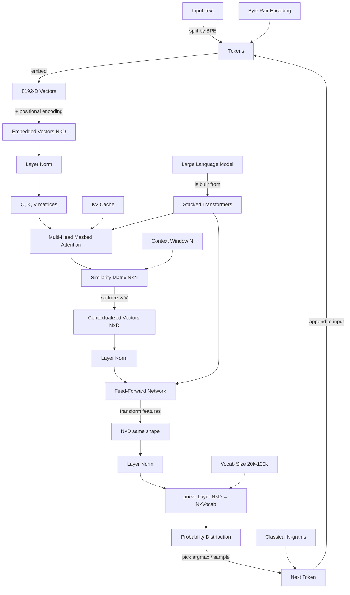

# Knowledge Graph — Session 1: LLM Basics & Transformer Internals

**Source:** [`transcripts/recording-51.srt`](transcripts/recording-51.srt)
**Instructor:** Gaurav Sen (Speaker 0)
**Duration:** 02:09:55 · **Segments:** 1991 · **Speakers:** 25

## Concept Map (Mermaid)

## Concept Hierarchy

| Layer | Concept | One-liner | Further reading |
|-------|---------|-----------|-----------------|
| 0 | **LLM** | Neural network trained to predict next token | [Vaswani 2017](https://arxiv.org/abs/1706.03762) · [3Blue1Brown — But what is a GPT?](https://www.3blue1brown.com/lessons/gpt/) |
| 1 | **Transformer block** | Attention + FFN stacked | [Vaswani 2017](https://arxiv.org/abs/1706.03762) · [Alammar — Illustrated Transformer](https://jalammar.github.io/illustrated-transformer/) |
| 2 | **Attention** | Q·K similarity + softmax × V → contextualized vectors | [Vaswani 2017 §3.2.1](https://arxiv.org/abs/1706.03762) · [Alammar](https://jalammar.github.io/illustrated-transformer/) |
| 2 | **Multi-head attention** | Parallel attention heads, each learning different relationships | [Vaswani 2017 §3.2.2](https://arxiv.org/abs/1706.03762) · [Transformer Circuits](https://transformer-circuits.pub/2021/framework/index.html) |
| 2 | **Masked attention** | Hide upper triangle → N predictions per N-token sentence | [Karpathy — Let's build GPT](https://www.youtube.com/watch?v=kCc8FmEb1nY) |
| 2 | **Feed-forward** | 8192-D → 8192-D feature transformation | [Vaswani 2017 §3.3](https://arxiv.org/abs/1706.03762) · [Raschka — Build an LLM](https://www.manning.com/books/build-a-large-language-model-from-scratch) |
| 3 | **Tokenization** | BPE / WordPiece / Unigram splits text into tokens | [HF NLP Course §4](https://huggingface.co/learn/llm-course/chapter2/4) · [Karpathy — Tokenizer](https://www.youtube.com/watch?v=zduSFxRajkE) |
| 3 | **Embedding** | Token → 8192-D vector | [Mikolov 2013 — Word2Vec](https://arxiv.org/abs/1301.3781) |
| 3 | **Positional encoding** | Adds position info to each vector | [Su 2021 — RoFormer](https://arxiv.org/abs/2104.09864) |
| 3 | **Linear layer** | N×D → N×vocab probability distribution | [Alammar — Illustrated GPT-2](https://jalammar.github.io/illustrated-gpt2/) |
| 4 | **KV cache** | Memoize K, V to avoid recomputing N×N | [HF KV cache docs](https://huggingface.co/docs/transformers/en/kv_cache) |
| 4 | **Context window** | N tokens the model can attend to | [Dao 2022 — FlashAttention](https://arxiv.org/abs/2205.14135) |
| 4 | **Vocabulary** | Token set the model knows (32k–256k+) | [HF NLP Course §4](https://huggingface.co/learn/llm-course/chapter2/4) |
| 4 | **Temperature / Top-k** | Decoding strategies for picking from distribution | [Alammar — Illustrated GPT-2](https://jalammar.github.io/illustrated-gpt2/) |

## Concept-to-Concept Relationships

| Concept A | Relationship | Concept B |
|-----------|--------------|-----------|
| LLM | builds upon | Transformer |
| Transformer | contains | Attention |
| Transformer | contains | Feed-Forward Network |
| Attention | requires | Query, Key, Value (Q, K, V) |
| Attention | requires | Similarity Matrix |
| Masked Attention | prevents | Future token cheating |
| Feed-Forward Network | transforms | Features (e.g., length × breadth = area) |
| Token | produced by | Byte Pair Encoding |
| Vector | represents | Token |
| Vector | has | D dimensions (8192 typical) |
| Embedding | feeds into | Transformer |
| Linear Layer | outputs | Probability Distribution |
| Probability Distribution | over | Vocabulary |
| KV Cache | optimizes | Attention |
| Context Window | limits | Attention |

## Key Q&A Recorded

| Question | Answer |
|---|---|
| What is a vector? | A token's coordinate in a high-D space; each dimension is conceptually a feature, but the model is just predicting the next token. |
| How do meaningless BPE tokens cluster? | The model learns 'royalty' as a feature; 'coronation', 'kingly', 'royal' cluster even though the tokens are meaningless in isolation. |
| Are LLMs and N-grams the same? | Yes, conceptually — both do next-token prediction. LLMs use learned transformations. |
| What is the FFN doing? | Transforming features into more useful features (same shape in/out). |
| Why is the context window limited? | Each token attends to all others; N×N cost scales quadratically. KV cache helps but is memory-expensive. |

## Key Takeaways

1. An LLM is a transformer-stack that predicts the next token autoregressively.
2. Tokens are sub-word units (BPE) mapped to vectors in a high-D space.
3. Attention turns ambiguous vectors into contextualized vectors via Q/K/V similarity.
4. Masked attention gives N training signals per N-token sentence.
5. Feed-forward layers transform features into more useful features (same shape in/out).
6. The linear layer at the end produces a probability distribution over vocabulary.
7. KV cache and vocabulary size are critical for performance and cost.

---

## 📚 Top references for this recording

- [Vaswani et al., 2017 — "Attention Is All You Need"](https://arxiv.org/abs/1706.03762) — *the transformer paper. Read §3 end-to-end.*
- [Jay Alammar — "The Illustrated Transformer"](https://jalammar.github.io/illustrated-transformer/) — *the single best visual walkthrough.*
- [Andrej Karpathy — "Let's build GPT"](https://www.youtube.com/watch?v=kCc8FmEb1nY) — *builds a GPT from scratch, causal masking included.*

---

## Related Materials

- 📝 Lecture summary (enriched): [`sessions/1-llm-basics.md`](sessions/1-llm-basics.md)
- 📄 Raw transcript: [`transcripts/recording-51.srt`](transcripts/recording-51.srt)
- 🧠 Structured JSON: [`sessions/1-llm-basics-graph.json`](sessions/1-llm-basics-graph.json)
- 🌐 Combined view: [`sessions/combined-knowledge-graph.md`](sessions/combined-knowledge-graph.md)
