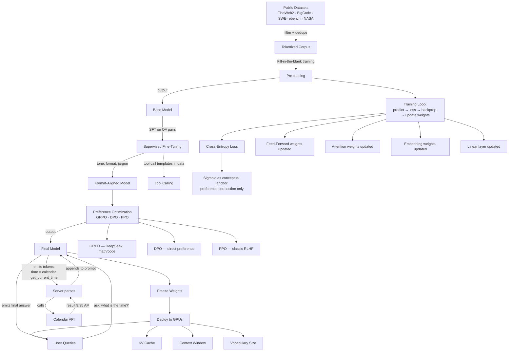
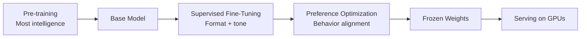
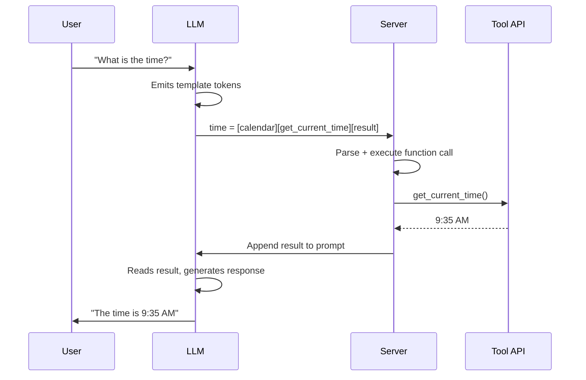

# Knowledge Graph — Recording 52: LLM Training, Tool Use & Fine-Tuning

**Source:** [`transcripts/recording-52.srt`](transcripts/recording-52.srt)
**Instructor:** Speaker 1 (NOT Gaurav Sen — see "Speakers" table in the lecture summary)
**Co-hosts:** Tanishk (IIT Bombay), Ariana (IIT Madras), Gaurav
**Duration:** 02:49:25 · **Segments:** 2559 · **Speakers:** 25

## Concept Map (Mermaid)

## Training Pipeline Stages

| Stage | Objective | Data | Output | Further reading |
|-------|-----------|------|--------|-----------------|
| **Pre-training** | Learn language, grammar, world knowledge | Public datasets (FineWeb2, BigCode, etc.) | Base model | [Ouyang 2022 — InstructGPT](https://arxiv.org/abs/2203.02155) · [Raschka — LLM Training & Evaluation](https://sebastianraschka.com/blog/2023/llm-training-and-evaluation.html) |
| **SFT** | Match desired tone, format, jargon | Human-written QA pairs | Format-aligned model | [Ouyang 2022](https://arxiv.org/abs/2203.02155) · [HF TRL SFTTrainer](https://huggingface.co/docs/trl/en/sft_trainer) |
| **Preference Optimization** | Learn from preference signals | Preference pairs (A is better than B) | Final model | [Schulman 2017 — PPO](https://arxiv.org/abs/1707.06347) · [Rafailov 2023 — DPO](https://arxiv.org/abs/2305.18290) · [Shao 2024 — GRPO](https://arxiv.org/abs/2402.03300) |
| **Serving** | Run inference | User queries | Responses | [Kwon 2023 — vLLM](https://arxiv.org/abs/2309.06180) · [vLLM blog](https://vllm.ai/blog/2023-06-20-vllm) |

## Tool-Calling Flow

**Key insight:** LLMs cannot actually make function calls. They only output tokens. The server interprets the convention and executes. Canonical reference: [OpenAI — Function calling blog (Jun 2023)](https://openai.com/index/function-calling-and-other-api-updates/).

## Concept-to-Concept Relationships

| Concept A | Relationship | Concept B |
|-----------|--------------|-----------|
| Pre-training | produces | Base Model |
| Pre-training | uses | Fill-in-the-blank training |
| Pre-training | uses | Cross-Entropy Loss |
| Base Model | is input to | SFT |
| SFT | produces | Format-aligned model |
| SFT | uses | Human-written QA pairs |
| Post-training | includes | SFT |
| Post-training | includes | Preference Optimization |
| Preference Optimization | variants | GRPO, DPO, PPO |
| GRPO | popularised by | DeepSeek |
| Tool Calling | learned via | SFT (special templates in training data) |
| Tool Calling | executed by | Server (not the LLM itself) |
| Model Serving | freezes | Weights |
| Model Serving | uses | KV Cache |
| Model Serving | uses | Context Window |
| GPU Orchestration | enables | Pipeline parallelism for large models |

## Concept Hierarchy

| Layer | Concept | One-liner | Further reading |
|-------|---------|-----------|-----------------|
| 0 | **LLM Lifecycle** | Pre-training → SFT → Preference Opt → Serving | [Ouyang 2022](https://arxiv.org/abs/2203.02155) |
| 1 | **Pre-training** | Massive data → next-token prediction | [Vaswani 2017 §5.4](https://arxiv.org/abs/1706.03762) |
| 1 | **SFT** | Human QA pairs → tone/format alignment | [HF TRL SFTTrainer](https://huggingface.co/docs/trl/en/sft_trainer) |
| 1 | **Preference Optimization** | RLHF algorithms for behavior | [Ouyang 2022](https://arxiv.org/abs/2203.02155) · [Lilian Weng — Reward Hacking](https://lilianweng.github.io/posts/2024-11-28-reward-hacking-in-rlhf/) |
| 1 | **Serving** | Frozen weights, GPU inference | [Kwon 2023 — vLLM](https://arxiv.org/abs/2309.06180) |
| 2 | **Pre-training Details** | Fill-in-the-blank, cross-entropy loss | [Vaswani 2017 §5.4](https://arxiv.org/abs/1706.03762) |
| 2 | **SFT Details** | Format, tone, jargon, tool-call templates | [Schick 2023 — Toolformer](https://arxiv.org/abs/2302.04761) |
| 2 | **Preference Opt Algorithms** | GRPO, DPO, PPO | [Schulman 2017](https://arxiv.org/abs/1707.06347) · [Rafailov 2023](https://arxiv.org/abs/2305.18290) · [Shao 2024](https://arxiv.org/abs/2402.03300) |
| 2 | **Serving Details** | KV cache, GPU orchestration, vocabulary | [Kwon 2023](https://arxiv.org/abs/2309.06180) · [Huang 2018 — GPipe](https://arxiv.org/abs/1811.06965) |
| 3 | **Tool Calling** | LLMs emit tokens; server interprets | [OpenAI — Function calling](https://openai.com/index/function-calling-and-other-api-updates/) |
| 3 | **Cross-Entropy Loss** | -log(p_expected_token) for one-hot target | [Goodfellow — Deep Learning Ch. 4](https://www.deeplearningbook.org/) |
| 3 | **Sigmoid** | Conceptual anchor in preference-opt | [Goodfellow — Deep Learning Ch. 3](https://www.deeplearningbook.org/) |

## Key Q&A Recorded

| Question | Answer |
|---|---|
| Does SFT involve manual annotation? | The output is human-written once, but losses are computed automatically. |
| How do you penalize on tokens with little context? | Deferred — model still gets a loss signal at every position. |
| What is the input/output size of the transformer? | N × D throughout; final linear: N × D → N × \|vocab\|. |
| How does tool calling actually work? | Model outputs a token template; server interprets; result appended to prompt. |
| What are modern preference optimization algorithms? | GRPO (DeepSeek, math/code), DPO, PPO. Sigmoid is the conceptual anchor. |
| Why input tokens > output tokens? | Apps pass documents, search results, page contents as input. |

## Key Takeaways

1. LLM training = **pre-training** (intelligence) + **post-training** (behavior) + **serving**.
2. Pre-training: tokenize massive data, predict next token at every position, cross-entropy loss.
3. SFT: human-written QA pairs for format/tone/jargon.
4. Tool calling is a **textual convention** — the model emits tokens; the server interprets.
5. Preference optimization refines behavior with reward signals (GRPO, DPO, PPO).
6. Model serving freezes weights; KV cache and vocabulary are key knobs for cost/performance.

---

## 📚 Top references for this recording

- [Ouyang et al., 2022 — InstructGPT (RLHF)](https://arxiv.org/abs/2203.02155) — *the canonical SFT → RM → PPO pipeline.*
- [Rafailov et al., 2023 — DPO](https://arxiv.org/abs/2305.18290) — *the DPO paper.*
- [Shao et al., 2024 — DeepSeekMath / GRPO](https://arxiv.org/abs/2402.03300) — *the GRPO paper.*
- [Kwon et al., 2023 — vLLM / PagedAttention](https://arxiv.org/abs/2309.06180) — *the serving paper.*

---

## Related Materials

- � Lecture summary (enriched): [`sessions/2-training-pipeline.md`](sessions/2-training-pipeline.md)
- 📄 Raw transcript: [`transcripts/recording-52.srt`](transcripts/recording-52.srt)
- 🧠 Structured JSON: [`sessions/2-training-pipeline-graph.json`](sessions/2-training-pipeline-graph.json)
- 🌐 Combined view: [`sessions/combined-knowledge-graph.md`](sessions/combined-knowledge-graph.md)
