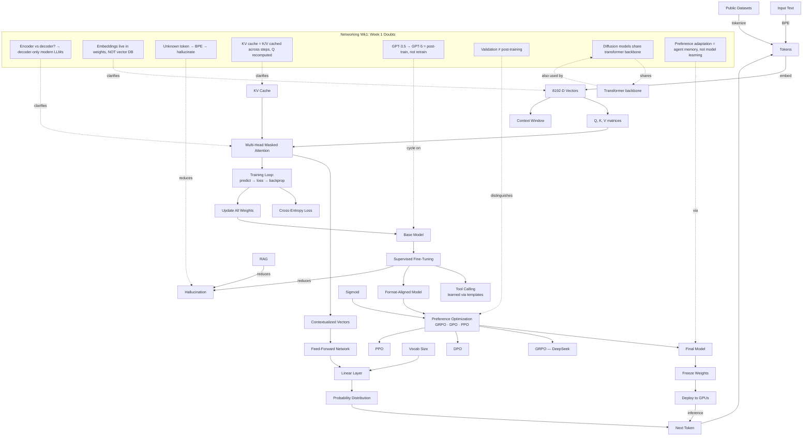
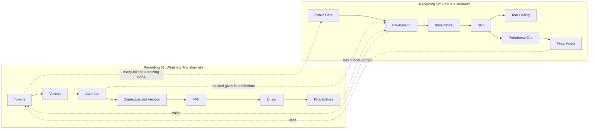
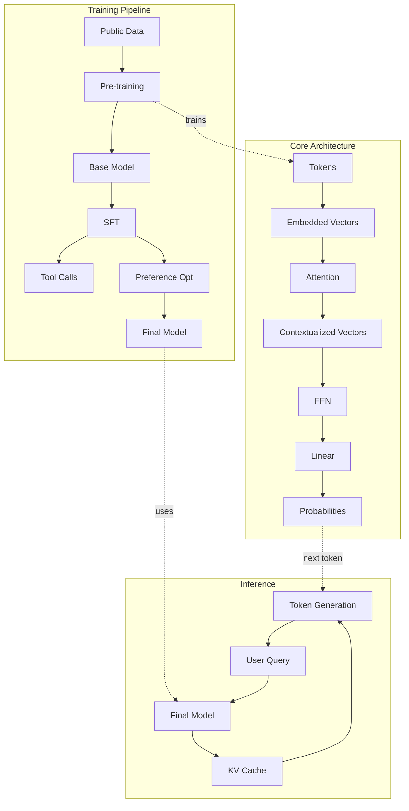

# Combined Knowledge Graph — Recordings 51, 52, and Week 1 Networking

Three sessions from the AI Engineering Cohort (InterviewReady / Gaurav Sen) covering the foundations of how LLMs work end-to-end.

| Recording | Topic | Duration | Instructor | Key Theme |
|-----------|-------|----------|------------|-----------|
| **[51](sessions/llm-basics-transformer-internals.md)** | LLM Basics & Transformer Internals | 02:09:55 | Gaurav Sen (Speaker 0) | Architecture, attention, FFN |
| **[52](sessions/llm-training-pipeline-tool-use.md)** | Training Pipeline, Tool Use & Fine-Tuning | 02:49:25 | Speaker 1 (NOT Gaurav Sen) | Pre-training, SFT, tool calling |
| **[Networking Week 1](sessions/doubts-networking-week-1.md)** | Week 1 Doubts & Networking | 01:42:01 | Gaurav Sen (host), Tanishk, Tanishq | Q&A on Q/K/V, embeddings, FFN, hallucination, careers |

> **Attribution note.** R52's long-form instructor is Speaker 1, who the transcript introduces separately from "Gaurav" (the co-host). Earlier versions of these notes mis-attributed R52 to Gaurav Sen — corrected here.
> **Networking Week 1 note.** This is a doubt-solving call that follows up on the R51/R52 material. Hosted by Gaurav Sen (Speaker 7) with co-instructors Tanishk (Speaker 1) and Tanishq (Speaker 4).

## End-to-End Concept Graph



## Concept Map Across Both Sessions

### From Recording 51 → Recording 52

| Recording 51 (Architecture) | Recording 52 (Training) |
|----------------------------|------------------------|
| Transformer block | Pre-training produces the base model |
| Attention (Q, K, V) | Updated during training via cross-entropy loss |
| Feed-forward network | Updated during training |
| Linear layer | Output of probability distribution over vocab |
| Masked attention | Why N tokens = N training signals |
| Vocabulary | Set of tokens the model knows |
| Context window | Defines N — token positions attended to |
| KV cache | Critical for inference speed (serving) |

## Cross-Session Concepts



## Unified Concept Index

### Architecture (Recording 51)

| Concept | Further reading |
|---------|-----------------|
| LLM definition | [Vaswani 2017](https://arxiv.org/abs/1706.03762) · [3Blue1Brown — But what is a GPT?](https://www.3blue1brown.com/lessons/gpt/) |
| Token + Byte Pair Encoding | [Sennrich 2016 — BPE](https://arxiv.org/abs/1508.07909) · [HF NLP Course §4](https://huggingface.co/learn/llm-course/chapter2/4) |
| Vector / Embedding | [Mikolov 2013 — Word2Vec](https://arxiv.org/abs/1301.3781) |
| Transformer block | [Vaswani 2017](https://arxiv.org/abs/1706.03762) · [Alammar — Illustrated Transformer](https://jalammar.github.io/illustrated-transformer/) |
| Multi-head attention | [Vaswani 2017 §3.2.2](https://arxiv.org/abs/1706.03762) · [Transformer Circuits](https://transformer-circuits.pub/2021/framework/index.html) |
| Masked attention | [Karpathy — Let's build GPT](https://www.youtube.com/watch?v=kCc8FmEb1nY) |
| Feed-forward network | [Vaswani 2017 §3.3](https://arxiv.org/abs/1706.03762) · [Raschka — Build an LLM](https://www.manning.com/books/build-a-large-language-model-from-scratch) |
| Linear layer / Unembedding | [Alammar — Illustrated GPT-2](https://jalammar.github.io/illustrated-gpt2/) |
| KV cache | [HF KV cache docs](https://huggingface.co/docs/transformers/en/kv_cache) |
| Context window | [Dao 2022 — FlashAttention](https://arxiv.org/abs/2205.14135) |
| Vocabulary | [HF NLP Course §4](https://huggingface.co/learn/llm-course/chapter2/4) |
| N-grams (historical comparison) | [Jurafsky & Martin — SLP Ch. 3](https://web.stanford.edu/~jurafsky/slp3/) |

### Training Pipeline (Recording 52)

| Concept | Further reading |
|---------|-----------------|
| Pre-training | [Ouyang 2022 — InstructGPT](https://arxiv.org/abs/2203.02155) · [Raschka — LLM Training](https://sebastianraschka.com/blog/2023/llm-training-and-evaluation.html) |
| Fill-in-the-blank training | [Vaswani 2017 §5.4](https://arxiv.org/abs/1706.03762) |
| Training loop | [Goodfellow — Deep Learning Ch. 8](https://www.deeplearningbook.org/) |
| Cross-entropy loss | [Goodfellow — Deep Learning Ch. 4](https://www.deeplearningbook.org/) |
| Sigmoid (conceptual) | [Goodfellow — Deep Learning Ch. 3](https://www.deeplearningbook.org/) |
| Base model | (see Pre-training) |
| Supervised fine-tuning (SFT) | [Ouyang 2022](https://arxiv.org/abs/2203.02155) · [HF TRL SFTTrainer](https://huggingface.co/docs/trl/en/sft_trainer) |
| Post-training | [Raschka — LLM Training](https://sebastianraschka.com/blog/2023/llm-training-and-evaluation.html) |
| Preference optimization | [Ouyang 2022](https://arxiv.org/abs/2203.02155) |
| GRPO | [Shao 2024 — DeepSeekMath](https://arxiv.org/abs/2402.03300) |
| DPO | [Rafailov 2023](https://arxiv.org/abs/2305.18290) |
| PPO | [Schulman 2017](https://arxiv.org/abs/1707.06347) |
| Tool calling / function calls | [OpenAI — Function calling blog](https://openai.com/index/function-calling-and-other-api-updates/) · [Schick 2023 — Toolformer](https://arxiv.org/abs/2302.04761) |
| Model serving | [Kwon 2023 — vLLM](https://arxiv.org/abs/2309.06180) |
| GPU orchestration | [Huang 2018 — GPipe](https://arxiv.org/abs/1811.06965) · [Shoeybi 2019 — Megatron-LM](https://arxiv.org/abs/1909.08053) |
| Data shortage | [Villalobos 2024 — Will we run out of data?](https://arxiv.org/abs/2211.04325) |
| Data pipeline | [HF FineWeb2 dataset card](https://huggingface.co/datasets/HuggingFaceFW/fineweb-2) |

### Auxiliary Concepts

- Input vs Output tokens → [HF Cookbook — KV cache speedup](https://huggingface.co/learn/cookbook/en/llm_inference_speed)
- Temperature / Top-k decoding → [Alammar — Illustrated GPT-2](https://jalammar.github.io/illustrated-gpt2/)
- Model parameters → [HF LLM Course Ch. 1](https://huggingface.co/learn/llm-course/chapter1)
- DeepSeek (GRPO populariser) → [Shao 2024 — DeepSeekMath](https://arxiv.org/abs/2402.03300)

### Doubt-Solving Clarifications (Networking Week 1)

| Clarified misconception | Resolution | Concept page |
|------------------------|------------|--------------|
| Encoders are needed at inference | Modern LLMs are decoder-only; encoder-only is used for embeddings | [Transformer](../concepts/transformer.md) |
| Embeddings are stored in a vector DB | Embeddings live inside model weights as the embedding matrix | [Vector (Embedding)](../concepts/vector-embedding.md) |
| Embeddings update separately from Q/K/V | Backprop updates everything learnable together | [Training Loop](../concepts/training-loop.md) |
| KV cache is a separate architecture | KV cache is an inference-time optimization of cached K/V tensors | [KV Cache](../concepts/kv-cache.md) |
| Unknown tokens are learned at inference | They are decomposed by BPE into known subwords; LLM best-guesses = hallucination | [Hallucination](../concepts/hallucination.md) |
| Labs retrain from scratch between versions | They run post-training cycles, not full retraining | [Pre-training](../concepts/pre-training.md) |
| Post-training = validation | Different concepts — one updates weights, one splits data | [Training Loop](../concepts/training-loop.md) |
| Diffusion models are completely different from LLMs | Same transformer backbone; differ in modality and output | [Transformer](../concepts/transformer.md) |
| LLMs learn user preferences at inference | No inference-time training; agents maintain external memory instead | [Tool Calling](../concepts/tool-calling.md) |

## People & Entities

### Instructors & Co-hosts

| Recording | Long-form instructor | Co-hosts |
|-----------|---------------------|----------|
| R51 | Gaurav Sen (Speaker 0) | (no co-hosts identified in transcript) |
| R52 | Speaker 1 | Tanishk (IIT Bombay), Ariana (IIT Madras), Gaurav |
| Networking Week 1 | Gaurav Sen (Speaker 7) | Tanishk (Speaker 1) — main voice answering technical Qs · Tanishq (Speaker 4) — screen-share demos |

### Datasets Mentioned

- **[FineWeb2](https://huggingface.co/datasets/HuggingFaceFW/fineweb-2)** — most popular web corpus in the lecture
- **BigCode** — 220M GitHub repos → 102 TB → 3 TB after filtering (see [BigCode paper](https://arxiv.org/abs/2211.03027))
- **SWE-rebench** — coding benchmark; transcript spells it "sw-rebench", canonical form is "SWE-rebench"
- **NASA** — corpus mentioned alongside FineWeb2/BigCode
- **Google private datasets** — mentioned but not detailed

### Papers Referenced

- [Vaswani et al., 2017 — Attention Is All You Need](https://arxiv.org/abs/1706.03762) (R51, Networking Wk1)
- [Schulman et al., 2017 — PPO](https://arxiv.org/abs/1707.06347) (R52)
- [Rafailov et al., 2023 — DPO](https://arxiv.org/abs/2305.18290) (R52)
- [Shao et al., 2024 — DeepSeekMath / GRPO](https://arxiv.org/abs/2402.03300) (R52)
- [Sennrich et al., 2016 — BPE](https://arxiv.org/abs/1508.07909) (R51, Networking Wk1 — for subword decomposition of unknown tokens)
- [Mikolov et al., 2013 — Word2Vec](https://arxiv.org/abs/1301.3781) (Networking Wk1 — for "cluster similar vectors" intuition)
- [Rombach et al., 2021 — Latent Diffusion / Stable Diffusion](https://arxiv.org/abs/2112.10752) (Networking Wk1 — ComfyUI / diffusion discussion)
- [Hu et al., 2021 — LoRA](https://arxiv.org/abs/2106.09685) (Networking Wk1 — LoRA for diffusion + LLMs)

### Vendors / Models

- **DeepSeek** — GRPO populariser; mentioned in Networking Wk1 token-vs-attention mixing question
- **Google / Gemini** — private datasets (R52); image generation (Networking Wk1 — "nano banana")
- **OpenAI** — tool-calling example (R52); GPT-3.5 → GPT-5 progression (Networking Wk1)
- **Gemma** — mention in Networking Wk1 token/attention mixing question
- **Flux / Flux Dev** — open-source diffusion model (Networking Wk1)
- **Meta (Llama)** — implicitly (RMSNorm / RoPE conventions)
- **Anthropic Claude** — recommended in Networking Wk1 for the mind-mapping learning workflow

## Mermaid Master Diagram



---

## 📁 File Index

```
aiengg/
├── README.md                                          # Overview & structure
├── _sidebar.md                                        # Docsify navigation
├── _coverpage.md                                      # Docsify cover page
├── index.html                                         # Docsify shell
│
├── sessions/
│   ├── index.md                                       # Master session list
│   ├── combined-knowledge-graph.md                    # Cross-session unified view
│   ├── llm-basics-transformer-internals.md             # R51 summary
│   ├── llm-basics-transformer-internals-graph.md       # R51 Mermaid + tables
│   ├── llm-basics-transformer-internals-graph.json     # R51 structured JSON
│   ├── llm-training-pipeline-tool-use.md               # R52 summary
│   ├── llm-training-pipeline-tool-use-graph.md         # R52 Mermaid + tables
│   ├── llm-training-pipeline-tool-use-graph.json       # R52 structured JSON
│   ├── doubts-networking-week-1.md                     # Week 1 networking Q&A
│   ├── doubts-networking-week-1-graph.md               # Week 1 networking Mermaid + tables
│   └── doubts-networking-week-1-graph.json             # Week 1 networking structured JSON
│
├── concepts/
│   ├── index.md                                       # Alphabetical concept index
│   └── ...                                            # ~28 concept pages
│
├── transcripts/
│   ├── recording-51.srt                               # Raw SRT (1991 segments)
│   ├── recording-52.srt                               # Raw SRT (2559 segments)
│   └── networking-session-1.srt                       # Week 1 networking SRT (1339 segments)
│
└── scripts/
    └── new-session.py                                 # SRT metadata extractor
```

---

## Related Materials

- 📝 R51 summary: [`sessions/llm-basics-transformer-internals.md`](sessions/llm-basics-transformer-internals.md)
- 📝 R52 summary: [`sessions/llm-training-pipeline-tool-use.md`](sessions/llm-training-pipeline-tool-use.md)
- 📝 Networking Week 1 summary: [`sessions/doubts-networking-week-1.md`](sessions/doubts-networking-week-1.md)
- 🕸️ R51 graph: [`sessions/llm-basics-transformer-internals-graph.md`](sessions/llm-basics-transformer-internals-graph.md)
- 🕸️ R52 graph: [`sessions/llm-training-pipeline-tool-use-graph.md`](sessions/llm-training-pipeline-tool-use-graph.md)
- 🕸️ Networking Week 1 graph: [`sessions/doubts-networking-week-1-graph.md`](sessions/doubts-networking-week-1-graph.md)
- 🧠 R51 JSON: [`sessions/llm-basics-transformer-internals-graph.json`](sessions/llm-basics-transformer-internals-graph.json)
- 🧠 R52 JSON: [`sessions/llm-training-pipeline-tool-use-graph.json`](sessions/llm-training-pipeline-tool-use-graph.json)
- 🧠 Networking Week 1 JSON: [`sessions/doubts-networking-week-1-graph.json`](sessions/doubts-networking-week-1-graph.json)
- 📄 R51 transcript: [`transcripts/recording-51.srt`](transcripts/recording-51.srt)
- 📄 R52 transcript: [`transcripts/recording-52.srt`](transcripts/recording-52.srt)
- 📄 Networking transcript: [`transcripts/networking-session-1.srt`](transcripts/networking-session-1.srt)
- 🌱 Browse concepts: [`../concepts/index.md`](../concepts/index.md)
