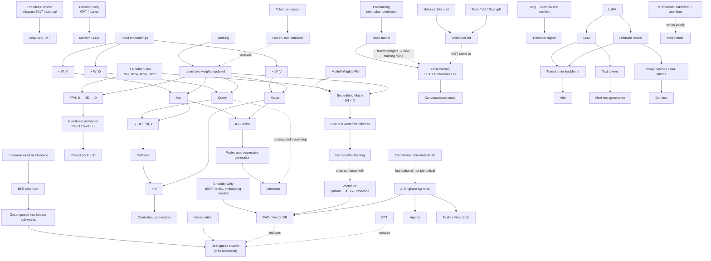

# Knowledge Graph — Week 1 Networking (Doubt-Solving)

**Source:** [`transcripts/networking-session-1.srt`](../transcripts/networking-session-1.srt)
**Session type:** Doubt-Solving (Wednesday networking call)
**Companion to:** [R51 — LLM Basics & Transformer Internals](llm-basics-transformer-internals.md) (which introduced these topics in teaching form)

## Concept Map

## Question → Concept Map

| Question (from SRT) | Concept it tests | Concept page |
|---------------------|------------------|--------------|
| Q1 — Hands-on math walkthrough (10 tokens) | Attention computation; Q·Kᵀ·V mechanics | [Attention](../concepts/attention.md) |
| Q2 — Encoder vs Decoder at inference | Architecture choice; decoder-only modern LLMs | [Transformer](../concepts/transformer.md) |
| Q3 — Where embeddings are stored | Embedding table inside model weights | [Vector Embedding](../concepts/vector-embedding.md) |
| Q4 — Why 768 dimensions | Hidden-state dimensionality as hyperparameter | [Model Parameters](../concepts/model-parameters.md) |
| Q5 — Are embeddings updated in backprop | Learnable vs frozen parameters | [Pre-training](../concepts/pre-training.md), [Training Loop](../concepts/training-loop.md) |
| Q6 — Unknown tokens & hallucination | BPE subword tokenization; hallucination as structural | [BPE](../concepts/byte-pair-encoding.md), [Token](../concepts/token.md) |
| Q7 — How is W_Q/W_K/W_V computed? | Linear projections in attention | [Attention](../concepts/attention.md) |
| Q8 — KV cache vs QKV | Inference optimization | [KV Cache](../concepts/kv-cache.md) |
| Q9 — FFN 4D expansion rationale | FFN hyperparameter; activation functions | [Feed-Forward Network](../concepts/feed-forward-network.md) |
| Q10 — FDE role readiness | Career outcomes; portfolio signals | — |
| Q11 — EVALs coverage depth | Evals as a knowledge category | [Preference Optimization](../concepts/preference-optimization.md) (related) |
| Q12 — Recruiter signals | Portfolio + personal brand | — |
| Q13 — Transformer depth for AI engineers | Calibration: system-level > internals | — |
| Q14 — Re-training between model versions | Post-training cycles | [Supervised Fine-Tuning (SFT)](../concepts/supervised-fine-tuning.md) |
| Q15 — Validation vs Post-training | Data split vs training stage | [Pre-training](../concepts/pre-training.md) |
| Q16 — Orchestration: Spark vs GPU | Data pipeline vs training infra | [Data Pipeline](../concepts/data-pipeline.md), [GPU Orchestration](../concepts/gpu-orchestration.md) |
| Q17 — ComfyUI / diffusion vs LLM | Shared transformer backbone, different modalities | [Transformer](../concepts/transformer.md) |
| Q18 — Preference adaptation at inference | Context window vs persistent memory | [Context Window](../concepts/context-window.md) |
| Q19 — Mind-mapping the curriculum | Meta-learning strategy | — |

## Concept Hierarchy

### Architecture (Week 1)
| Layer | Concept | One-liner | Further reading |
|-------|---------|-----------|-----------------|
| Architecture family | [Transformer](../concepts/transformer.md) | Encoder-decoder with stacked attention + FFN | [Vaswani 2017](https://arxiv.org/abs/1706.03762) |
| Sub-architecture | Decoder-only LLM | No encoder; Q/K/V all from the same decoder stream | [Alammar — Illustrated GPT-2](https://jalammar.github.io/illustrated-gpt2/) |
| Sub-architecture | Encoder-only | Bidirectional representation; used for embeddings | [Devlin 2018 — BERT](https://arxiv.org/abs/1810.04805) |
| Mechanism | [Attention](../concepts/attention.md) | Three projections (Q, K, V) + softmax(Q·Kᵀ/√d)·V | [Vaswani §3.2](https://arxiv.org/abs/1706.03762) |
| Mechanism | [FFN](../concepts/feed-forward-network.md) | D → 4D → D, non-linear | [Vaswani §3.3](https://arxiv.org/abs/1706.03762) |

### Storage & Representation
| Layer | Concept | One-liner | Further reading |
|-------|---------|-----------|-----------------|
| Representation | [Vector embedding](../concepts/vector-embedding.md) | One row of the `|V| × D` matrix per token | [Mikolov 2013](https://arxiv.org/abs/1301.3781) |
| Hyperparameter | Hidden dim `D` | Width of every layer; 768 / 1024 / 4096 / 8192 | [Kaplan 2020](https://arxiv.org/abs/2001.08361) |
| Tokenization | [BPE](../concepts/byte-pair-encoding.md) | Subword merges; handles OOV | [Sennrich 2016](https://arxiv.org/abs/1508.07909) |

### Training vs Inference
| Layer | Concept | One-liner | Further reading |
|-------|---------|-----------|-----------------|
| Stage | [Pre-training](../concepts/pre-training.md) | Next-token prediction on huge corpus | [Vaswani §5.4](https://arxiv.org/abs/1706.03762) |
| Stage | [SFT](../concepts/supervised-fine-tuning.md) | Instruction-following via Q/A pairs | [Ouyang 2022](https://arxiv.org/abs/2203.02155) |
| Stage | [Preference Optimization](../concepts/preference-optimization.md) | RLHF / DPO / GRPO on human preferences | [Ouyang 2022](https://arxiv.org/abs/2203.02155) |
| Mechanism | [Training Loop](../concepts/training-loop.md) | Forward → loss → backprop → weight update | [Goodfellow Ch. 8](https://www.deeplearningbook.org/) |
| Optimization | [KV cache](../concepts/kv-cache.md) | Cached K, V tensors across generation steps | [HF KV cache docs](https://huggingface.co/docs/transformers/en/kv_cache) |

### AI-Engineering Stack
| Layer | Concept | One-liner | Further reading |
|-------|---------|-----------|-----------------|
| Retrieval | RAG | Embed external docs; store in vector DB | [Lewis 2020 — RAG](https://arxiv.org/abs/2005.11401) |
| Agent | Tool calling | LLM emits tokens; server interprets | [Schick 2023 — Toolformer](https://arxiv.org/abs/2302.04761) |
| Evaluation | EVAL suite | Metrics (faithfulness, recall, tool accuracy) | [RAGAS](https://arxiv.org/abs/2309.15217) |
| Orchestration | [GPU orchestration](../concepts/gpu-orchestration.md) | Distributing training across GPU clusters | [Megatron-LM](https://arxiv.org/abs/1909.08053) |
| Modalities | Diffusion model | Transformer backbone on image latents | [Rombach 2021](https://arxiv.org/abs/2112.10752) |

## Concept-to-Concept Relationships

| From | Relationship | To |
|------|-------------|-----|
| Encoder | compressed into | Embedding vector |
| Decoder-only LLM | generates | Next token |
| Tokenizer | produces | Token IDs |
| Token ID | indexes row of | Embedding matrix |
| Embedding matrix | stored inside | Model weights file |
| Q, K, V | computed by | Linear projection from embedding |
| Attention output | feeds into | FFN |
| FFN | expands | D → 4D → D |
| Pre-training | produces | Base model |
| Post-training | runs on | Base model |
| Inference | uses | KV cache |
| Validation | distinct from | Post-training |
| BPE | decomposes | OOV words |
| OOV word | produces | Hallucinated answer |
| RAG | reduces | Hallucination |
| LoRA | fine-tunes | Diffusion or LLM |
| Diffusion model | shares | Transformer backbone with LLM |
| Modalities | differ | Text vs image tokens |
| Personal brand | signals | Recruiter |

## Key Q&A Recorded

| Question | Answer |
|----------|--------|
| Why 768 dimensions? | Architectural hyperparameter chosen at design time; values from random init + gradient descent, frozen at inference |
| Are embeddings updated during backprop? | Yes — everything learnable is updated. Tokenizer vocab and token-ID map are not. |
| How do QKV relate to the embedding matrix? | Q, K, V are linear projections of X using learned W_Q, W_K, W_V matrices |
| Is KV cache the same as QKV? | No — KV cache holds K, V across generation steps. Q is recomputed. |
| What happens with unknown tokens? | BPE decomposes into known subwords; LLM makes best-guess answer (= hallucination). |
| Does post-training mean inference? | No. Pre-training + post-training both update weights. Inference is just a forward pass. |
| Can I mix DeepSeek tokenizer + Gemma attention? | No — each model's embedding table is aligned with its own K/V projections. |

## Key Takeaways

1. **Modern LLMs are decoder-only** — the encoder-decoder distinction matters mostly when explaining historical/embedding models.
2. **Embeddings live inside model weights** as the embedding matrix; they are *not* in a vector DB. The vector-DB confusion is from RAG, a separate concept.
3. **Backprop updates everything learnable** — embeddings, Q/K/V, FFN. Tokenizer rules are not learnable.
4. **KV cache ≠ QKV** — it is an inference-time optimization caching K/V across steps.
5. **Hallucination is structural**, not a bug: BPE + best-guess + no real-time learning → plausible but possibly wrong.
6. **Pre-training + post-training are both training**; validation is a held-out data split, not a separate training stage.
7. **For AI engineering roles, system-level depth (RAG, agents, evals) > transformer internals depth**.
8. **Personal brand via published artifacts** (blogs, open-source repos) is the highest-leverage recruiter signal.
9. **Diffusion models and LLMs share the transformer backbone**; the difference is modality (image latents vs text tokens) and output (denoising vs next-token).
10. **Cannot fine-tune at inference** — anything that "remembers" preferences is an agent layer feeding context, not a model parameter change.

## Top References

- [Vaswani et al., 2017 — Attention Is All You Need](https://arxiv.org/abs/1706.03762)
- [Jay Alammar — The Illustrated Transformer / GPT-2](https://jalammar.github.io/)
- [Andrej Karpathy — Let's build GPT (backprop walkthrough)](https://www.youtube.com/watch?v=kCc8FmEb1nY)
- [HF NLP Course (chapter 2 — Transformers; chapter 4 — BPE)](https://huggingface.co/learn/llm-course)
- [Ouyang et al., 2022 — InstructGPT (RLHF pipeline)](https://arxiv.org/abs/2203.02155)
- [Rombach et al., 2021 — Latent Diffusion Models](https://arxiv.org/abs/2112.10752)
- [Hu et al., 2021 — LoRA: Low-Rank Adaptation](https://arxiv.org/abs/2106.09685)

## Related Materials

- 📝 Session summary: [`doubts-networking-week-1.md`](doubts-networking-week-1.md)
- 📄 Raw transcript: [`../transcripts/networking-session-1.srt`](../transcripts/networking-session-1.srt)
- 🌱 Browse concepts: [`../concepts/index.md`](../concepts/index.md)
- 📚 Earlier teaching session this week: [R51 — LLM Basics & Transformer Internals](llm-basics-transformer-internals.md)
- 📚 The next teaching session: [R52 — Training Pipeline, Tool Use & Fine-Tuning](llm-training-pipeline-tool-use.md)
- 🌐 [Combined knowledge graph](combined-knowledge-graph.md)
